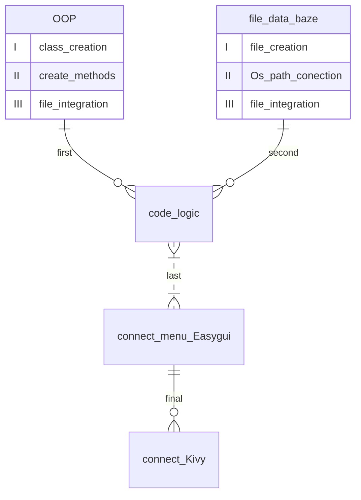

# CoffeeShop Меню. 
Робота з файлами\
Візуалізація через бібліотеку Kivy i Easygui
****
>homework from it acadeny
****
:eyes: усі файли мають бути в одній папці для коректної роботи коду
(так, як у коді присутні images для візуальної демонстрації)\
:exclamation:Також, не варто переносити нікуди папку `data` так, як у ній є текстові файли, які використовуються для роботи з файлами.

Потрібно встановити:
| Три бібліотеки у коді| Версія | Команди|
|----------------|:---------:|----------------:|
| Math | по дефолту | import math |
| Os.path| по дефолту | import os.path |
| Easygui | 0.98.3 | from easygui import * |

>Хід роботи - які знання були задіяні в коді:


 ### :question: Що може код?

- [X] Демонструвати меню з вашого файл_меню. :fork_and_knife:
    - [X] Ви можете переписувати меню у файлі і кожного разу воно буде іншим у програмі.
    - [X] Запис має відповідати заданій вже послідовності і типу.
- [X] Мати базу даних клієнтів.
  - [X] У файл з клієнтами, при кожній покупці, за бажанням покупця - буде внесено його ім'я. 
  - [X] Ви зможете побачити скільки даний користувач загалом у вас залишив грошей.
- [X] Знижка постійним клієнтам. :purple_heart:
     - [X] У коді прописана система знижок, яку вільно можна міняти:
     
```Python
    def discount_calculation(discount):
        if discount < 100:
            return 0
        elif discount < 200:
            return 1
        elif discount < 500:
            return 2
        else:
            return 5
```

 Вказаний % знижки нараховується, якщо клієнт перейшов певний поріг витрат у вас. Цю кількість ми дізнаємось з файлу клієнтів по імені клієнта.
 - [X] Розрахунок у різних валютах.
     - [X] У коді прописана система конвертації з євро і доларів у гривні і навпаки. При покупці - користувач може вибрати, якою валютою він буде розраховуватись.
 - [X] Запис продажів. :notebook:
     - [X] У коді прописаний запис купленого товару у файл_продажів.
     - [X] Також при записі покупки - з файл_меню(складу) буде списуватись -1 шт. товару.
 
 Для коректної роботи коду - використовуйте надані файли у папці `data`.
