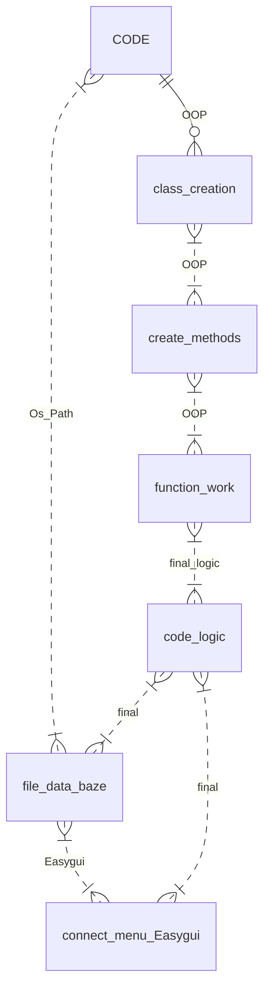

# CoffeeShop Menu in easygui
____
*Homework from it-academy*
-----------
____
| Три бібліотеки у коді| Версія | Команди|
|----------------|:---------:|----------------:|
| Math | по дефолту | import math |
| Os.path| по дефолту | import os.path |
| Easygui | 0.98.3 | from easygui import * |

:eyes: усі файли мають бути в одній папці для коректної роботи коду
(так, як у коді присутні images для візуальної демонстрації)

:exclamation:Також, не варто переносити нікуди папку `data` так, як у ній є текстові файли, які використовуються для роботи з файлами.

>Хід роботи - які знання були задіяні в коді:

